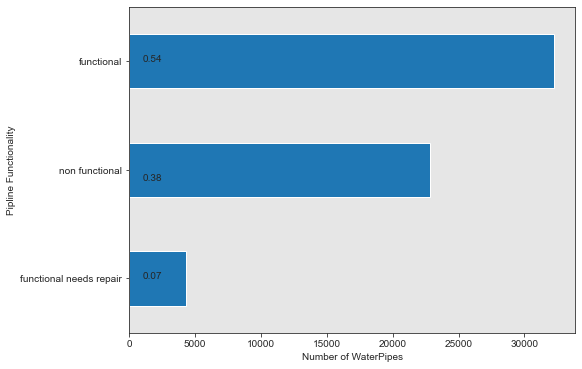
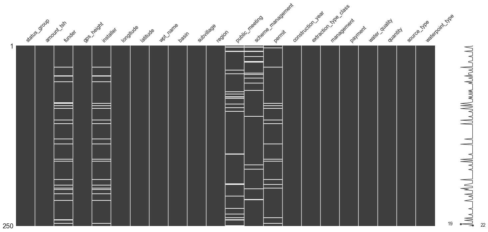
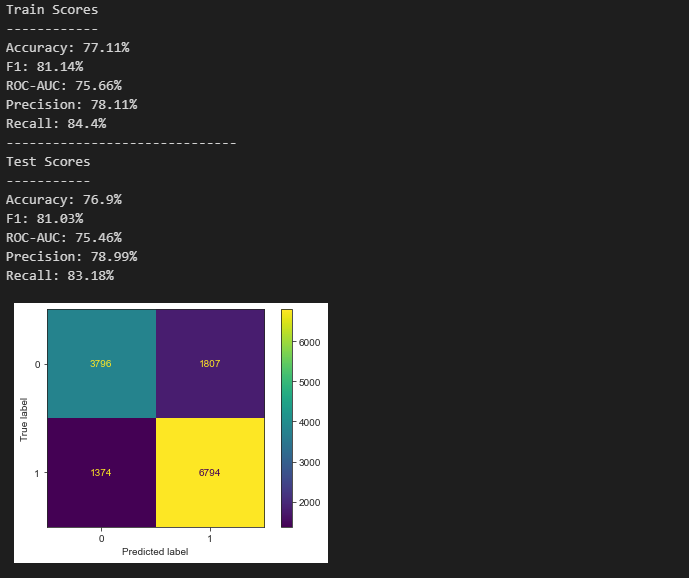
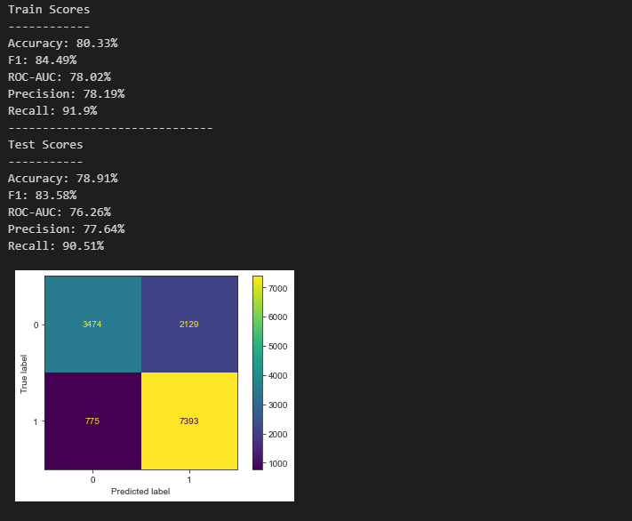
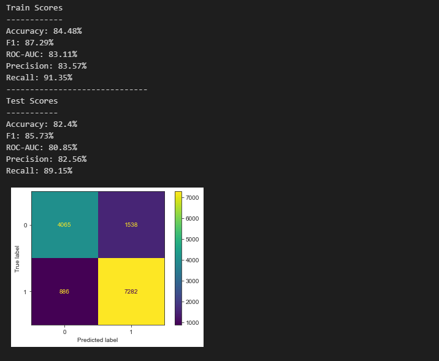
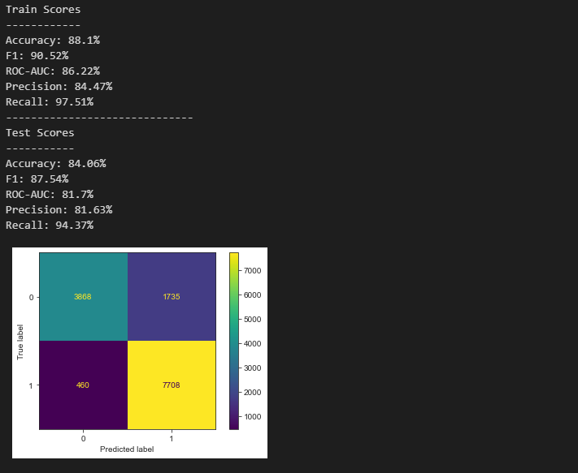
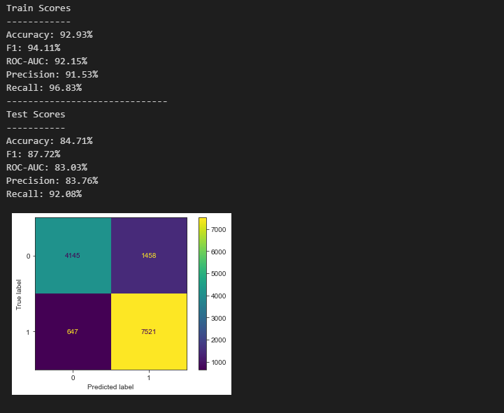
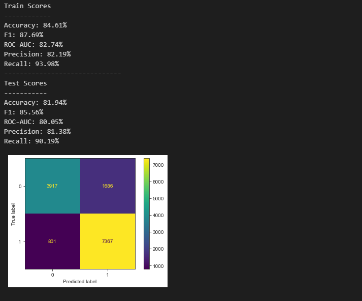
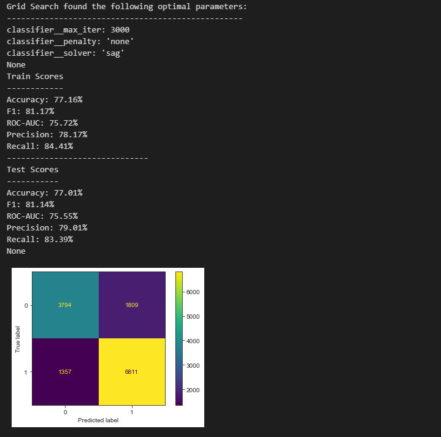
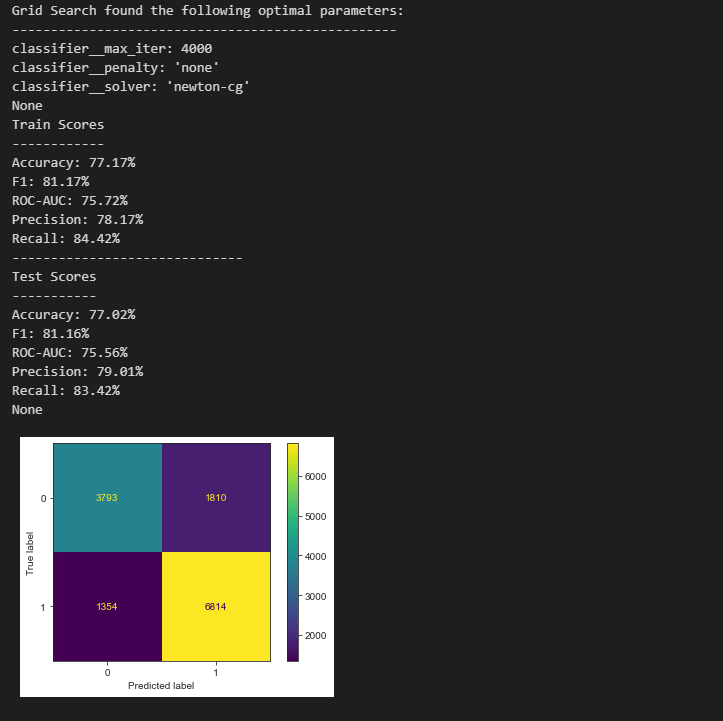

# Predicting the Functionality of Water Pipelines in Tanzania using Machine Learning Classification Models
---

---
## Table of Contents
1. [Business Understanding](#1.-Business-Understanding)
2. [Data Understanding](#2.-Data-Understanding)
3. [Modeling](#3-modeling)
4. [Final Model Further Evaluation and Tuning](#4-final-model-further-evaluation)
5. [Conclusion](#5-conclusion)
6. [Recommendations](#6-recommendations)

# 1. Business Understanding

There is a country in East Africa known as Tanzania and for many years, villages across this country have struggled accessing clean and healthy water sources. In the case where villagers have access to a water well, the quality of the water will always be in question. Not to mention, people often have to travel great distances to access these water wells. To tackle this problem, I will be taking a deeper look at the data provided by Taarifa and the Tanzanian Ministry of Water, In hopes of being able to accurately predict the functionality of the water pipelines in Tanzania. I believe that by predicting how well the water pipelines function, there will then be a better understanding of which waterpoints will fail, thus focusing on how to improve and maintain clean, portable water for communities across Tanzania.

# 2. Data Understanding

The data collected for this project consists of three seperate csv files. One of the first steps I took was to concatenate these seperate dataframes in a way that makes sense. The documentation has also been recorded for each of the data columns. To view the documentation ahead of time, please click this [link](https://www.drivendata.org/competitions/7/pump-it-up-data-mining-the-water-table/page/25/#features_list 'This will open another tab'). As for the three datasets, they are located in the repository under `Tanzanian_Datasets`, if you would like to view those seperately on your own. The column features in these data frames are all relative to how water piplines are produced and manufactured in Tanzania. The data consists of features that state- who funded the well, the year the waterpoint was constructed, how the waterpoint is managed etc.

This project initially posed itself as a trinary classifcation problem. The reason being is that the data contained 3 potential target variables - 'functional', 'non-functional' and 'functional needs repair'.

This is what the classes looked like with nearly 60k rows in the combined datasets:

So between `functional` and `non functional`, there isnt much of a class imbalance unless we also consider `functional needs repair`, which is only 7% of the data. 

This leaves me to make a pretty big judgement call on whether or not I am going to keep the `functional needs repair` class, as part of the dataframe and overall project.

By eliminating this class, I am only taking out 7% of the data, as well as lessening the complexity of the project. The objective and goal of the project still remains intact, and the classification project goes from ternary to binary.
In doing this, I hope to simplify the modeling process while being able to more accurately predict whether a pipeline is strictly `functional` or `non functional`.

After further exploratory data analysis and cleaning, I created a null value matrix to visualize the frequency of null values:

The white lines displayed in the columns represent missing data. The entirety of the chart represents the data frame as a whole to put the missing/null data into perspective.

Considering the missing values in the feature columns range between 1%-5%, I decided to leave them as is. The reason for this is so that I can let the machine learning models handle the missing values for me. More in-depth information on how I go about that is documented in my ['Full_Notebook'](Notebook/Full_Notebook.ipynb). 

# 3. Modeling
---
Given that this will be a classification project, one of the ways I will be analyzing the model results, will be through a confusion matrix. Not only will I be able to view the accuracy of my model's predictions but I will also be able to view both the `type I` and `type II` errors. For this project in particular, I value a `type I` error more than a `type II` error and I will explain why.

A `type I` error accounts for the (false-positives) in my predictive model. Esentially meaning that when my model predicts that a water pipeline was non-functional, but the true value states that the water pipeline was functional, it will be counted as a (false-positive) or `type I` error. Although this is still an error, It will be a better error to make, as opposed to my model predicting a water pipeline was functional but the true value stating that the pipeline was non-functional. Which would then be a (false-negative) `type II` error.

Baseline model showed satisfactory results.
I would've liked to have more false positives(`type I`) than false negatives(`type II`)
I will continue to build and test other models using my pipeline, this time with more parameters within each unique
classifier to obtain the best results.

**NOTE: False positives are located at the bottom left corner of the confusion matrix and the false negatives are located diagonally across in the top right corner of the confusion matrix.
Hence why I mentioned that I would've liked false positive number (1368) to be higher than the false negative number (1811).**

## Logistic Regression Results

---
## Decision Tree w/ GridSearchCV Results

---
## K-Nearest Neighbors w/ GridSearchCV Results

---
## Random Forest w/ GridSearchCV Results

---
## XGBoost w/ GridSearchCV Results

---
## Support Vector Machine w/ GridSearchCV Results

---
# 4. Final Model Further Evaluation
After analyzing the results from each of the 6 machine learning models above, the Logistic Regression had shown the best results. I will create 2 new versions of this model using gridsearchcv to hypertune the parameters and see if I can get better results!

## Version 1

---
## Version 2

---
# 5. Conclusion
After further tunning the Logistic Regression model and using different sets of gridsearch parameters, Version 1 came within .03% of testing better than the training set for the F1 score. With the precision score testing better than the training set!

Version 2 was just .01% shy of testing better than the training set for the F1 score at 81.16% ! Therefore, version 2 of this Logistic Regression model is going to be the best model fit for predicting the classes of functional and non functional pipelines! 

### Train-Test-Split VS K-Fold Cross Validation

Although these results are based off a single train-test-split method, I have also ran these models on a K-Fold method with 7 folds. However, further analysis needs to be conducted on the results of those models because unfortunately, confusion matrixes are a lot harder to plot on a K-Fold cross validation. You can view the K-Fold results [here](Notebook/Test_K_Fold/Testing_K_Fold.ipynb) !

# 6. Recommendations
- Given that the data that inlvolved the target variable 'functional needs repair' was excluded from the project, I believe running a linear regression model can help reassure and/or exploit further findings. This way we'd be able to find trends and any other correlation between the feature columns and why a water pipeline was functional but needed repair. 

- The longitude and latitude feature columns were taken out of the datasets and I believe they can still be of use. This can help geographically locate the functionality of the waterpipelines and can potentionally expose trends.

- K-Fold Cross Validation is a very useful tool to be able to test and train all the data with various different sample techniques. I have ran this method on all my models however I have not applied any in depth evaluation techniques to further understand the results the best way I can.
---

 